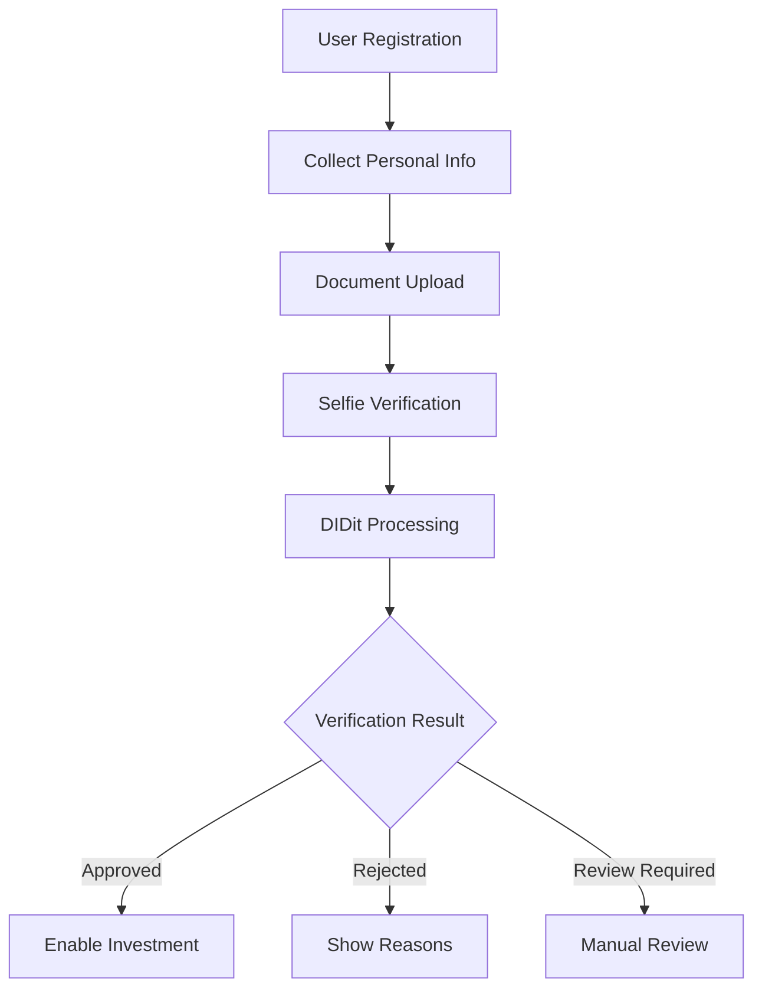

# DIDit KYC Integration Guide

## 🆔 Complete DIDit Identity Verification Setup

Using your DIDit credentials, here's the complete guide for implementing KYC/AML compliance.

### 1. Environment Configuration

Your DIDit credentials are already configured in `.env.local`:

```bash
# DIDit KYC Configuration
DIDIT_CLIENT_ID="cAZsSyfcdX3IUOZlChrsjQ"
DIDIT_CLIENT_SECRET="DyBZga1hQhLI6MV2dhmq5fYsn25n4FP8JkmXN0-fOno"
DIDIT_BASE_URL="https://api.didit.id"
```

### 2. KYC Flow Overview



### 3. KYC Component Implementation

```typescript
// src/components/kyc/KYCVerificationFlow.tsx
'use client';

import { useState } from 'react';
import { useRouter } from 'next/navigation';
import { toast } from 'react-hot-toast';
import { Upload, Camera, FileText, Shield, CheckCircle } from 'lucide-react';

const KYC_STEPS = [
  { id: 'personal', name: 'Personal Information', icon: FileText },
  { id: 'identity', name: 'Identity Document', icon: Shield },
  { id: 'address', name: 'Proof of Address', icon: FileText },
  { id: 'selfie', name: 'Selfie Verification', icon: Camera },
  { id: 'review', name: 'Review & Submit', icon: CheckCircle }
];

export default function KYCVerificationFlow() {
  const router = useRouter();
  const [currentStep, setCurrentStep] = useState(0);
  const [formData, setFormData] = useState({
    // Personal Information
    firstName: '',
    lastName: '',
    dateOfBirth: '',
    nationality: '',
    phone: '',
    
    // Address
    address: {
      street: '',
      city: '',
      state: '',
      postalCode: '',
      country: ''
    },
    
    // Documents
    identityDocument: {
      type: 'passport' as 'passport' | 'id_card' | 'driving_license',
      front: '',
      back: '',
      selfie: ''
    },
    
    addressProof: {
      type: 'utility_bill' as 'utility_bill' | 'bank_statement',
      document: '',
      issueDate: ''
    },
    
    // Investment Profile
    investmentExperience: 'none' as 'none' | 'limited' | 'experienced',
    estimatedNetWorth: 0,
    sourceOfFunds: '',
    pep: false
  });

  const handleFileUpload = async (
    field: string, 
    file: File
  ): Promise<string> => {
    return new Promise((resolve) => {
      const reader = new FileReader();
      reader.onloadend = () => {
        resolve(reader.result as string);
      };
      reader.readAsDataURL(file);
    });
  };

  const handleSubmit = async () => {
    try {
      const response = await fetch('/api/kyc', {
        method: 'POST',
        headers: {
          'Content-Type': 'application/json',
          'Authorization': `Bearer ${localStorage.getItem('token')}`
        },
        body: JSON.stringify({
          ...formData,
          taxResident: [formData.address.country]
        })
      });

      if (!response.ok) {
        const error = await response.json();
        throw new Error(error.error || 'KYC submission failed');
      }

      const result = await response.json();
      
      if (result.status === 'approved') {
        toast.success('Identity verified successfully!');
        router.push('/dashboard');
      } else if (result.status === 'requires_review') {
        toast.info('Your verification is under review. We\'ll notify you soon.');
        router.push('/dashboard');
      } else {
        toast.error('Verification failed: ' + result.reasons?.join(', '));
      }
      
    } catch (error) {
      toast.error(error.message);
    }
  };

  return (
    <div className="max-w-4xl mx-auto p-6">
      {/* Progress Steps */}
      <div className="mb-8">
        <div className="flex justify-between">
          {KYC_STEPS.map((step, index) => (
            <div 
              key={step.id}
              className={`flex-1 ${index < KYC_STEPS.length - 1 ? 'relative' : ''}`}
            >
              <div className="flex flex-col items-center">
                <div className={`
                  w-12 h-12 rounded-full flex items-center justify-center
                  ${index <= currentStep ? 'bg-blue-600 text-white' : 'bg-gray-200'}
                `}>
                  <step.icon className="w-6 h-6" />
                </div>
                <span className="text-sm mt-2">{step.name}</span>
              </div>
              {index < KYC_STEPS.length - 1 && (
                <div className={`
                  absolute top-6 left-1/2 w-full h-0.5
                  ${index < currentStep ? 'bg-blue-600' : 'bg-gray-200'}
                `} />
              )}
            </div>
          ))}
        </div>
      </div>

      {/* Step Content */}
      <div className="bg-white rounded-lg shadow p-6">
        {currentStep === 0 && <PersonalInfoStep formData={formData} setFormData={setFormData} />}
        {currentStep === 1 && <IdentityDocumentStep formData={formData} setFormData={setFormData} onFileUpload={handleFileUpload} />}
        {currentStep === 2 && <AddressProofStep formData={formData} setFormData={setFormData} onFileUpload={handleFileUpload} />}
        {currentStep === 3 && <SelfieStep formData={formData} setFormData={setFormData} onFileUpload={handleFileUpload} />}
        {currentStep === 4 && <ReviewStep formData={formData} />}
      </div>

      {/* Navigation */}
      <div className="flex justify-between mt-6">
        <button
          onClick={() => setCurrentStep(Math.max(0, currentStep - 1))}
          disabled={currentStep === 0}
          className="px-4 py-2 border rounded disabled:opacity-50"
        >
          Previous
        </button>
        
        {currentStep < KYC_STEPS.length - 1 ? (
          <button
            onClick={() => setCurrentStep(currentStep + 1)}
            className="px-4 py-2 bg-blue-600 text-white rounded hover:bg-blue-700"
          >
            Next
          </button>
        ) : (
          <button
            onClick={handleSubmit}
            className="px-4 py-2 bg-green-600 text-white rounded hover:bg-green-700"
          >
            Submit Verification
          </button>
        )}
      </div>
    </div>
  );
}
```

### 4. Document Upload Component

```typescript
// src/components/kyc/DocumentUpload.tsx
import { useCallback } from 'react';
import { useDropzone } from 'react-dropzone';
import { Upload, X } from 'lucide-react';

interface DocumentUploadProps {
  label: string;
  accept?: string;
  value?: string;
  onChange: (file: File) => Promise<void>;
  guidelines?: string[];
}

export default function DocumentUpload({ 
  label, 
  accept = 'image/*', 
  value, 
  onChange,
  guidelines 
}: DocumentUploadProps) {
  const onDrop = useCallback(async (acceptedFiles: File[]) => {
    if (acceptedFiles[0]) {
      await onChange(acceptedFiles[0]);
    }
  }, [onChange]);

  const { getRootProps, getInputProps, isDragActive } = useDropzone({
    onDrop,
    accept: { [accept]: [] },
    maxFiles: 1,
    maxSize: 10 * 1024 * 1024 // 10MB
  });

  return (
    <div>
      <label className="block text-sm font-medium text-gray-700 mb-2">
        {label}
      </label>
      
      {!value ? (
        <div
          {...getRootProps()}
          className={`
            border-2 border-dashed rounded-lg p-6 text-center cursor-pointer
            ${isDragActive ? 'border-blue-500 bg-blue-50' : 'border-gray-300'}
          `}
        >
          <input {...getInputProps()} />
          <Upload className="w-12 h-12 text-gray-400 mx-auto mb-2" />
          <p className="text-sm text-gray-600">
            {isDragActive
              ? 'Drop the file here...'
              : 'Drag & drop or click to upload'}
          </p>
          <p className="text-xs text-gray-500 mt-1">
            Maximum file size: 10MB
          </p>
        </div>
      ) : (
        <div className="relative">
          
          <button
            onClick={() => onChange(null)}
            className="absolute top-2 right-2 p-1 bg-red-500 text-white rounded-full"
          >
            <X className="w-4 h-4" />
          </button>
        </div>
      )}
      
      {guidelines && (
        <ul className="mt-2 text-xs text-gray-500 space-y-1">
          {guidelines.map((guideline, index) => (
            <li key={index}>• {guideline}</li>
          ))}
        </ul>
      )}
    </div>
  );
}
```

### 5. Selfie Verification Component

```typescript
// src/components/kyc/SelfieCapture.tsx
import { useRef, useState, useCallback } from 'react';
import { Camera, RotateCw } from 'lucide-react';

interface SelfieCaptureProps {
  onCapture: (imageData: string) => void;
}

export default function SelfieCapture({ onCapture }: SelfieCaptureProps) {
  const videoRef = useRef<HTMLVideoElement>(null);
  const [stream, setStream] = useState<MediaStream | null>(null);
  const [capturedImage, setCapturedImage] = useState<string | null>(null);
  const [facingMode, setFacingMode] = useState<'user' | 'environment'>('user');

  const startCamera = useCallback(async () => {
    try {
      const mediaStream = await navigator.mediaDevices.getUserMedia({
        video: { facingMode }
      });
      
      if (videoRef.current) {
        videoRef.current.srcObject = mediaStream;
      }
      setStream(mediaStream);
    } catch (error) {
      console.error('Failed to access camera:', error);
    }
  }, [facingMode]);

  const capturePhoto = () => {
    if (videoRef.current) {
      const canvas = document.createElement('canvas');
      canvas.width = videoRef.current.videoWidth;
      canvas.height = videoRef.current.videoHeight;
      const ctx = canvas.getContext('2d');
      
      if (ctx) {
        ctx.drawImage(videoRef.current, 0, 0);
        const imageData = canvas.toDataURL('image/jpeg');
        setCapturedImage(imageData);
        onCapture(imageData);
        
        // Stop camera
        if (stream) {
          stream.getTracks().forEach(track => track.stop());
        }
      }
    }
  };

  const retake = () => {
    setCapturedImage(null);
    startCamera();
  };

  return (
    <div className="space-y-4">
      <div className="relative bg-black rounded-lg overflow-hidden">
        {!capturedImage ? (
          <>
            <video
              ref={videoRef}
              autoPlay
              playsInline
              className="w-full h-96 object-cover"
              onLoadedMetadata={() => {
                if (videoRef.current) {
                  videoRef.current.play();
                }
              }}
            />
            
            {/* Face guide overlay */}
            <div className="absolute inset-0 flex items-center justify-center">
              <div className="w-64 h-80 border-4 border-white rounded-full border-dashed opacity-50" />
            </div>
            
            <div className="absolute bottom-4 left-0 right-0 flex justify-center space-x-4">
              <button
                onClick={capturePhoto}
                className="p-4 bg-white rounded-full hover:bg-gray-100"
              >
                <Camera className="w-6 h-6" />
              </button>
              
              <button
                onClick={() => setFacingMode(prev => prev === 'user' ? 'environment' : 'user')}
                className="p-4 bg-white rounded-full hover:bg-gray-100"
              >
                <RotateCw className="w-6 h-6" />
              </button>
            </div>
          </>
        ) : (
          <>
            
            
            <div className="absolute bottom-4 left-0 right-0 flex justify-center">
              <button
                onClick={retake}
                className="px-4 py-2 bg-white text-black rounded hover:bg-gray-100"
              >
                Retake Photo
              </button>
            </div>
          </>
        )}
      </div>
      
      {!stream && !capturedImage && (
        <button
          onClick={startCamera}
          className="w-full py-2 bg-blue-600 text-white rounded hover:bg-blue-700"
        >
          Start Camera
        </button>
      )}
      
      <div className="text-sm text-gray-600">
        <p>📸 Position your face within the oval guide</p>
        <p>💡 Ensure good lighting and plain background</p>
        <p>😊 Look directly at the camera</p>
      </div>
    </div>
  );
}
```

### 6. KYC Status Display

```typescript
// src/components/kyc/KYCStatusBadge.tsx
import { Shield, AlertCircle, Clock, CheckCircle } from 'lucide-react';

interface KYCStatusBadgeProps {
  status: 'not_submitted' | 'pending' | 'approved' | 'rejected' | 'requires_review';
  showDetails?: boolean;
}

export default function KYCStatusBadge({ status, showDetails = false }: KYCStatusBadgeProps) {
  const statusConfig = {
    not_submitted: {
      icon: AlertCircle,
      color: 'bg-gray-100 text-gray-800',
      label: 'KYC Required',
      description: 'Complete identity verification to start investing'
    },
    pending: {
      icon: Clock,
      color: 'bg-yellow-100 text-yellow-800',
      label: 'Verification Pending',
      description: 'Your documents are being reviewed'
    },
    approved: {
      icon: CheckCircle,
      color: 'bg-green-100 text-green-800',
      label: 'Verified',
      description: 'Your identity has been verified'
    },
    rejected: {
      icon: AlertCircle,
      color: 'bg-red-100 text-red-800',
      label: 'Verification Failed',
      description: 'Please resubmit your documents'
    },
    requires_review: {
      icon: Shield,
      color: 'bg-blue-100 text-blue-800',
      label: 'Under Review',
      description: 'Additional review required'
    }
  };

  const config = statusConfig[status];
  const Icon = config.icon;

  return (
    <div className={`inline-flex items-center px-3 py-1 rounded-full text-sm ${config.color}`}>
      <Icon className="w-4 h-4 mr-1" />
      <span className="font-medium">{config.label}</span>
      {showDetails && (
        <span className="ml-2 text-xs opacity-75">{config.description}</span>
      )}
    </div>
  );
}
```

### 7. Testing & Webhooks

```typescript
// src/app/api/webhooks/didit/route.ts
import { NextRequest, NextResponse } from 'next/server';
import { PrismaClient } from '@prisma/client';
import crypto from 'crypto';

const prisma = new PrismaClient();

export async function POST(request: NextRequest) {
  try {
    const body = await request.text();
    const signature = request.headers.get('x-didit-signature');
    
    // Verify webhook signature
    const expectedSignature = crypto
      .createHmac('sha256', process.env.DIDIT_WEBHOOK_SECRET!)
      .update(body)
      .digest('hex');
    
    if (signature !== expectedSignature) {
      return NextResponse.json({ error: 'Invalid signature' }, { status: 401 });
    }

    const event = JSON.parse(body);

    switch (event.type) {
      case 'verification.completed':
        await handleVerificationCompleted(event.data);
        break;
        
      case 'verification.failed':
        await handleVerificationFailed(event.data);
        break;
        
      case 'verification.requires_review':
        await handleVerificationReview(event.data);
        break;
    }

    return NextResponse.json({ received: true });
  } catch (error) {
    console.error('DIDit webhook error:', error);
    return NextResponse.json({ error: 'Webhook failed' }, { status: 500 });
  }
}

async function handleVerificationCompleted(data: any) {
  await prisma.kycSubmission.update({
    where: { verificationId: data.verification_id },
    data: {
      status: 'APPROVED',
      confidence: data.confidence_score,
      verifiedAt: new Date()
    }
  });

  // Update user KYC status
  const submission = await prisma.kycSubmission.findUnique({
    where: { verificationId: data.verification_id }
  });

  if (submission) {
    await prisma.user.update({
      where: { id: submission.userId },
      data: { kycStatus: 'APPROVED' }
    });
  }
}
```

### 8. Test Mode

For development, DIDit provides test documents:

```typescript
const TEST_DATA = {
  // Test passport that will pass verification
  passport: {
    front: 'https://test-documents.didit.id/passport-front.jpg',
    back: null,
    selfie: 'https://test-documents.didit.id/selfie-match.jpg'
  },
  
  // Test ID card that will fail
  idCard: {
    front: 'https://test-documents.didit.id/id-front-expired.jpg',
    back: 'https://test-documents.didit.id/id-back-expired.jpg',
    selfie: 'https://test-documents.didit.id/selfie-mismatch.jpg'
  }
};
```

## 🔐 Security Best Practices

1. **Never expose credentials** in frontend code
2. **Use HTTPS** for all document uploads
3. **Encrypt sensitive data** at rest
4. **Implement rate limiting** on KYC endpoints
5. **Log all verification attempts** for compliance
6. **Secure document storage** with proper access controls

## 📊 Compliance Dashboard

Track KYC metrics:
- Verification success rate
- Average processing time
- Rejection reasons breakdown
- Geographic distribution
- PEP/Sanctions hit rate